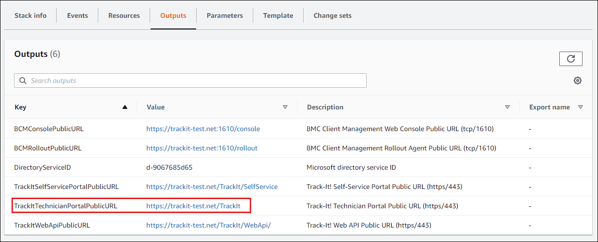
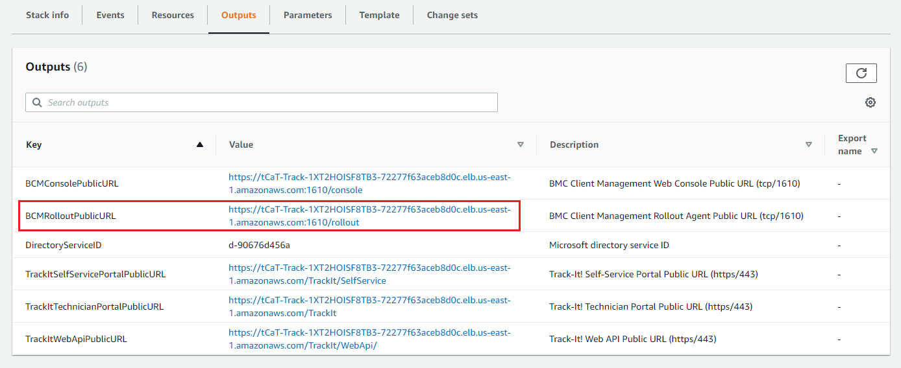
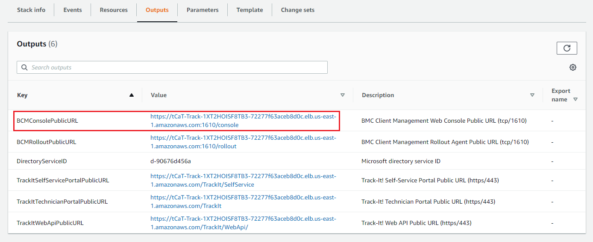
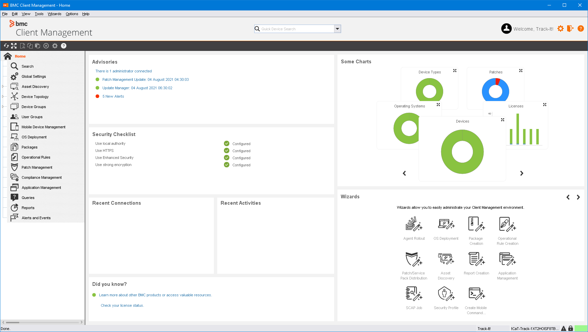
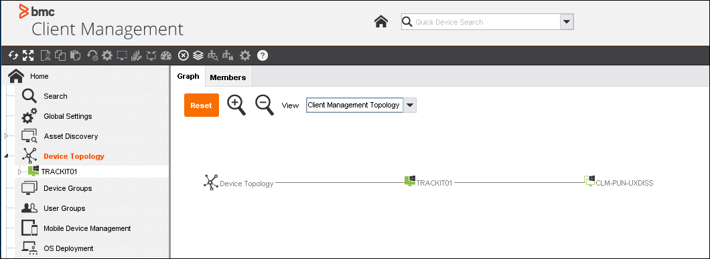
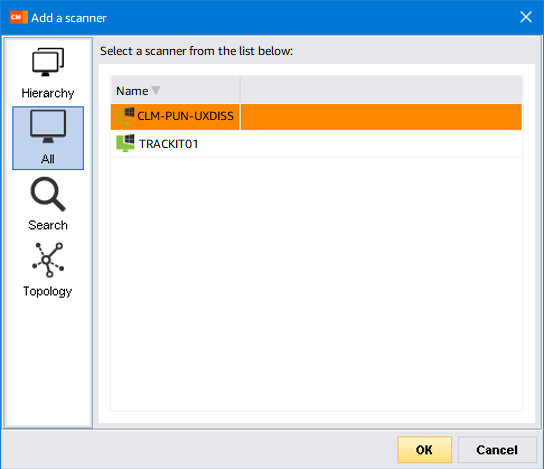

// Add steps as necessary for accessing the software, post-configuration, and testing. Don’t include full usage instructions for your software, but add links to your product documentation for that information.
//Should any sections not be applicable, remove them

== Post-deployment steps

=== Test the deployment
Test the deployment by accessing the Track-It portal.

. Open the https://console.aws.amazon.com/cloudformation/[AWS CloudFormation console^].
. On the *Stacks* page, choose the stack name.
. On the *Outputs* tab, note the URL in the *Value* column of the  *TrackItTechnicianPortalPublicURL* key.

[#outputs1]
.Track It portal URL
[link=images/outputs1.png]

[start=2]
. Navigate to the URL from step 3.
. Complete the form on the *Export Compliance And Access Terms* page and choose *Continue*.

[NOTE]
==== 
* If you receive an error stating *We are unable to grant access to the application at this time*, contact BMC support for assistance.

* If you did not enter link:#_parameter_reference[registered domain parameters] during deployment, a browser privacy warning displays before the Track-It login page. Choose to continue to the site.
====

[start=4]
:xrefstyle: short
. The Track-It login screen displays. The default Track-It login credentials are *ADMINISTRATOR/password*.

=== Install BMC Client Management relay agent
After deployment, you must install a BMC Client Management relay agent on one of your on-premises Microsoft Windows servers. A relay agent collects and transmits data from your on-premises network infrastructure to the BMC Client Management server on the Track-It EC2 instance.

NOTE: These instructions describe a Windows relay agent installation. To install a relay agent on Linux, see https://docs.bmc.com/docs/bcm2008/rolling-out-the-relay-agents-930382510.html[Rolling out the relay agents^].

. Open the https://console.aws.amazon.com/cloudformation/[AWS CloudFormation console^].
. On the *Stacks* page, choose the stack name.
. On the *Outputs* tab, note the URL in the *Value* column of the *BCMRolloutPublicURL* key.

[#outputs2]
.BMC Client Management rollout public URL 
[link=images/outputs2.png]

[start=4]
. Navigate to the URL from step 3.
. A browser privacy warning displays. BMC Client Management uses a self-signed certificate. Choose to continue to the site.
. The BMC Client Management login page displays. Log in with the password you entered for the `TrackItBcmAdminPassword` link:#_parameter_reference[parameter] during deployment. 
. On the *Welcome to the Rollout Server Download Page*, choose *BCM_Agent_Install.exe* in the *Auto-extractable Name* column.
. A Windows Defender warning displays. Choose *More info*, then *Run anyway*.
. After the installation is complete, a message stating *The Agent has been installed successfully* displays. Choose *OK*.

=== Install and configure BMC Client Management Console
. Open the https://console.aws.amazon.com/cloudformation/[AWS CloudFormation console^].
. On the *Stacks* page, choose the stack name.
. On the *Outputs* tab, note the URL in the *Value* column of the *BCMConsolePublicURL* key.

[#outputs3]
.BMC Client Management console URL 
[link=images/outputs3.png]

[start=4]
. Navigate to the URL from step 3.
. A browser privacy warning displays. BMC Client Management uses a self-signed certificate. Choose to continue to the site.
. The BMC Client Management login page displays. Log in with the password you entered for the `TrackItAdminPassword` link:#_parameter_reference[parameter] during deployment.
. On the *BMC Client Management Console Download Page*, choose *Web Start Package*.
. After the application downloads, log in with the same credentials you used to access the BMC Client Management portal in step 6. Keep the *Server Port* and *Secure Connection* default entries. The BMC Client Management console home screen displays.

[#console5]
.BMC Client Management console home screen
[link=images/console5.png]

=== Set relay agent as the scanner
To enable discovery of your on-premises devices, complete the following configuration in the BMC Client Management console.

. In the BMC Client Management console, choose *Device Topology* in the navigation bar.

[#console6]
.Device topology
[link=images/console6.png]

NOTE: The server onto which you installed the relay agent previously should display in the topology. If you don't see it, troubleshoot the link:#_install_bmc_client_management_relay_agent[relay agent installation].

[start=2]
. In the navigation bar, choose *Asset Discovery*. 
. Open the context (right-click) menu for *Scanners*, then choose *Add Device*.
. In the *Add a scanner* dialog box, choose the server on which the relay agent was installed previously.
. Choose *OK*.

[#console8]
.Add a scanner
[link=images/console8-resized.png]

== Getting started with {partner-product-short-name}
For an introduction to Track-It, see https://docs.bmc.com/docs/trackit2020/en/getting-started-912125630.html[Getting started^] and https://docs.bmc.com/docs/trackit2020/en/training-videos-912125636.html[Training videos^].
