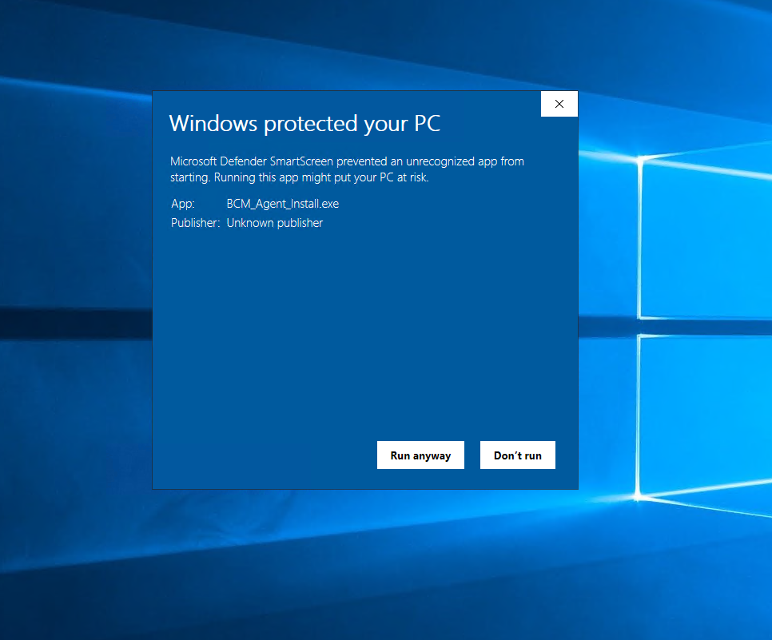
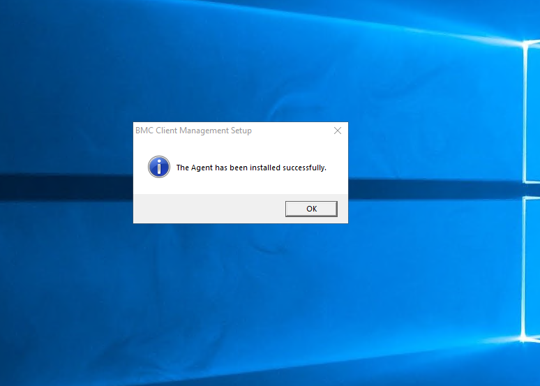
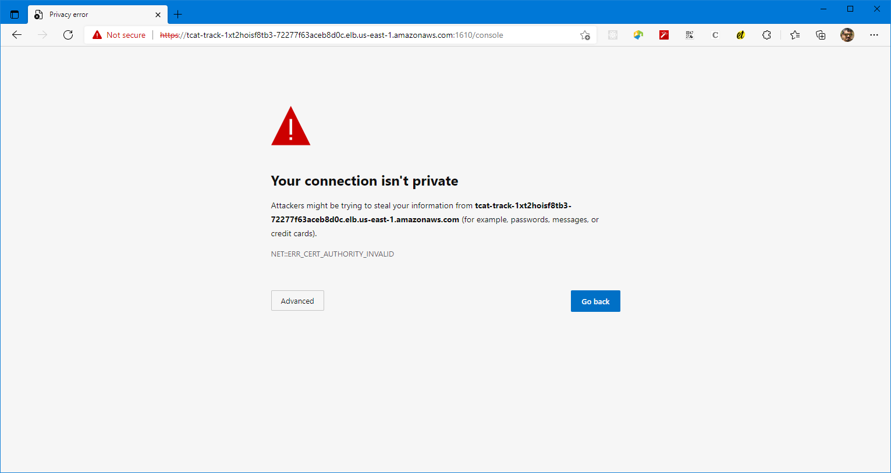

// Add steps as necessary for accessing the software, post-configuration, and testing. Don’t include full usage instructions for your software, but add links to your product documentation for that information.
//Should any sections not be applicable, remove them

== Test the deployment
. After the deployment is completed, you can launch the Technician portal. Check the *Outputs* section of the main stack and navigate to the URL beside the *TrackItTechnicianPortalPublicURL* key.

[#outputs1]
.{partner-product-short-name} Technician portal URL
[link=images/outputs1.png]
image::../images/outputs1.png[outputs1,width=1235,height=502]

[start=2]
. When you launch the application URL for the first time, the *Export Compliance And Access Terms* page is displayed. You need to fill in the form and accept the terms to gain access to {partner-product-short-name}.

[#export1]
.Export Compliance and Access Terms
[link=images/export_compliance.png]
image::../images/export_compliance.png[export,width=1235,height=502]

[start=3]
. After you click *Continue* on the *Export Compliance And Access Terms* page, the information is processed by a BMC system for auditing purposes. If it is determined that access cannot be granted, then a message similar to the following is displayed:

[#export2]
.Export Compliance error
[link=images/export_compliance_error.png]
image::../images/export_compliance_error.png[export_err,width=1235,height=502]

[start=4]
. You must contact BMC Support with the information that is displayed in Figure 4 for assistance.

. If there is no error, the {partner-product-short-name} Technician portal login screen is displayed momentarily as seen in the following figure:

[#trackit1]
.{partner-product-short-name} Technician portal login screen
[link=images/trackit1.png]
image::../images/trackit1.png[export_err,width=1235,height=502]

== Post deployment steps

=== Getting started with {partner-product-short-name}
Review the https://docs.bmc.com/docs/trackit2020/en/getting-started-912125630.html[Getting started^] {partner-product-short-name} documentation for a brief introduction to product features. Bookmark this page for quick access to product documentaion.

=== BMC Client Management Relay agent
To fully leverage the BCM functionality, you must install the BCM relay agent on one of your on-premises Microsoft Windows servers. The relay agent collects data of your on-premises network infrastructure and transmits it to the master server located on the {partner-product-short-name} EC2 instance. Follow the steps given below.

NOTE: BCM supports relay installation on the Linux OS. However this Quick Start only generates a Microsoft Windows relay installation. If you need to install the relay on Linux please consult the BCM documentation located https://docs.bmc.com/docs/bcm2008/rolling-out-the-relay-agents-930382510.html[here^].

. Relay agent installer can be downloaded by launching the URL next to the key denoted by *BCMRolloutPublicURL* on the *Outputs* tab of the main stack. 

[#outputs2]
.{partner-product-short-name} BMC Client Management rollout URL 
[link=images/outputs2.png]
image::../images/outputs2.png[outputs1,width=1235,height=502]

[start=2]
. Upon launching the *BCMRolloutPublicURL* in a browser, a warning is displayed as seen in the following figure. This happens because BCM uses self-signed certificates. It is safe to continue.

[#rollout1]
.BMC Client Management certificate warning
[link=images/rollout1.png]
image::../images/rollout1.png[export,width=1235,height=502]

[start=3]
. Upon continuing the following login screen is displayed.

[#rollout2]
.BMC Client Management rollout login page
[link=images/rollout2.png]
image::../images/rollout2.png[export,width=1235,height=502]

[start=4]
. Log-in with the *Track-It!* user to access the rollout download page. The password for this user is supplied as a parameter in the CloudFormation template.

. Click the _BCM_Agent_Install.exe_ link to download the rollout installation.

[#rollout3]
.BMC Client Management rollout download page
[link=images/rollout3.png]
image::../images/rollout3.png[export,width=1235,height=502]

[start=6]
. Upon launching the installer you should see a warning similar to the following. Click *More info* followed by *Run anyway*.

[#rollout4]
.Rollout install warning
[link=images/rollout4.png]
image::../images/rollout4.png[export,width=1235,height=502]

[#rollout5]
.Ignore rollout install warning
[link=images/rollout5.png]

[start=7]
. The installation is an automated process which does not require any user input. After a few minutes you should see the following message. The relay agent has installed successfully.

[#rollout6]
.BMC Client Management rollout download page
[link=images/rollout6.png]

=== BMC Client Management Console
In order to correctly configure BCM to work with {partner-product-short-name} you also need to install the BCM console and complete some manual configuration. Follow the steps given below.

. The Client Management console should be installed by navigating to the URL denoted by *BCMConsolePublicURL* on the *Outputs* tab of the main stack.

[#outputs3]
.{partner-product-short-name} BMC Client Management console URL 
[link=images/outputs3.png]
image::../images/outputs3.png[outputs1,width=1235,height=502]

[start=2]
. Upon launching the *BCMConsolePublicURL* in a browser, a warning is displayed as seen in the following figure. This happens because BCM uses self-signed certificates. It is safe to continue.

[#console1]
.BMC Client Management certificate warning
[link=images/console1.png]

[start=3]
. Upon continuing the following login screen is displayed:

[#console2]
.BMC Client Management console login screen
[link=images/console2.png]
image::../images/console2.png[export,width=1235,height=502]

[start=4]
. Log-in with the *Track-It!* user. The password for this user is supplied as a parameter in the CloudFormation template.

. Click the *Web Start Package* button on the console download page to download the console app. Once downloaded launch the app.

[#console3]
.BMC Client Management console download page
[link=images/console3.png]
image::../images/console3.png[export,width=1235,height=502]

[start=6]
. Leave the default selections as-is and log-in using the same credentials used earlier. 

[#console4]
.BMC Client Management console login screen
[link=images/console4.png]
image::../images/console4.png[export,width=1235,height=502]

[start=7]
. Upon successful login, you should see the home page similar to the following figure.

[#console5]
.BMC Client Management console home screen
[link=images/console5.png]
image::../images/console5.png[export,width=1235,height=502]

=== Set relay agent as the scanner
In order to perform discovery of your on-premises devices, additional manual configuration is required. Follow the steps given below.

. From the navigation bar, click *Device Topology* to show the graph of the devices. You should be able to see the server on which the relay agent installed previously. If you don't see it then verify the relay installation.

[#console6]
.BMC Client Management console device topology screen
[link=images/console6.png]
image::../images/console6.png[export,width=1235,height=502]

[start=2]
. From the navigation bar, expand *Asset Discovery* then right-click the *Scanners* node and click *Add Device*.

[#console7]
.BMC Client Management console asset discovery screen
[link=images/console7.png]
image::../images/console7.png[export,width=1235,height=502]

[start=3]
. In the *Add a scanner* dialog select the device on which the relay agent was installed previously and click *OK*.

[#console8]
.BMC Client Management console asset discovery screen
[link=images/console8.png]
image::../images/console8.png[export,width=486,height=420]

[start=4]
. This completes all the steps necessary to configure your relay agent for use with {partner-product-short-name}.

==== Default credentials

|===
|System|User name |Password

// Space needed to maintain table headers
|Track-It! Technician portal|`+ADMINISTRATOR+` |`+welcome+`

|===

== Training Videos

For information about how to use and configure {partner-product-short-name}, see https://docs.bmc.com/docs/trackit2020/en/training-videos-912125636.html[Training videos^].
