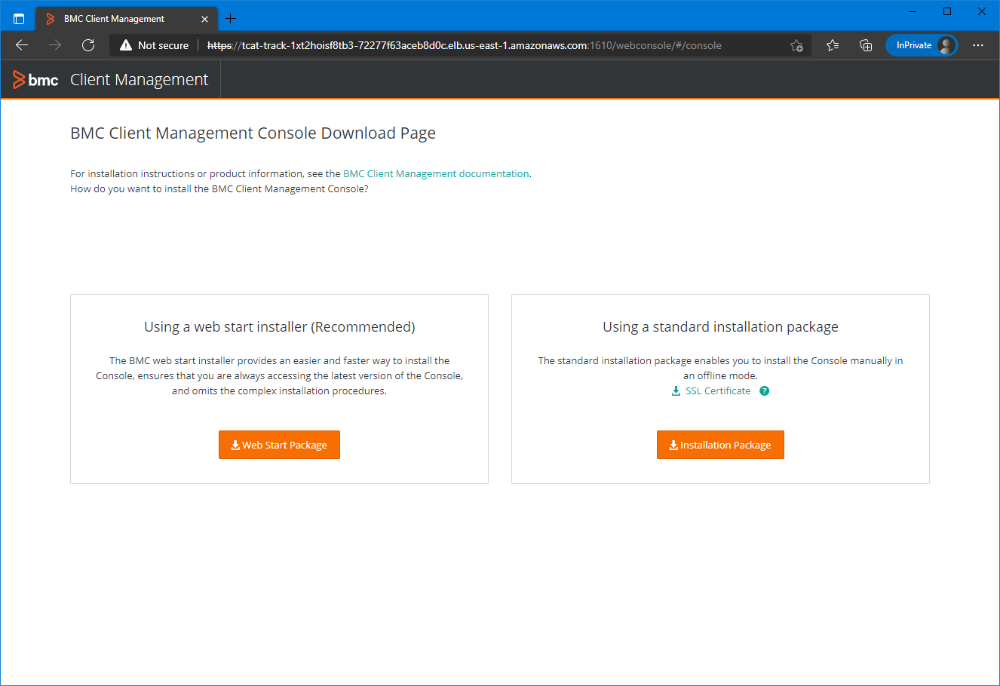
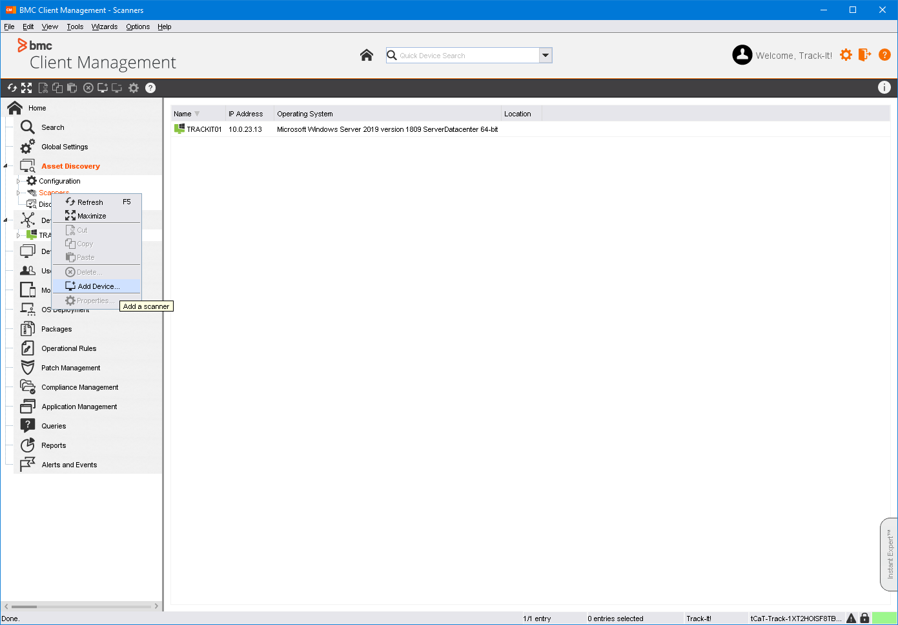

// Add steps as necessary for accessing the software, post-configuration, and testing. Don’t include full usage instructions for your software, but add links to your product documentation for that information.
//Should any sections not be applicable, remove them

== Post-deployment steps

=== Test the deployment
Test the deployment by accessing the Track It portal.

. Open the https://console.aws.amazon.com/cloudformation/[AWS CloudFormation console].
. On the *Stacks* page, choose the stack name.
. On the *Outputs* tab, note the URL in the *Value* column of the  *TrackItTechnicianPortalPublicURL* key.

[#outputs1]
.{partner-product-short-name} Track It Technician Client portal URL
[link=images/outputs1.png]
image::../images/outputs1.png[outputs1,width=650,height=266]

[start=2]
. Navigate to the URL.
. Complete the form on the *Export Compliance And Access Terms* page and choose *Continue*.

[NOTE]
==== 
* If you receive an error stating *We are unable to grant access to the application at this time*, contact BMC support for assistance.

* If you did not enter link:#_parameter_reference[registered domain parameters] during deployment, a browser privacy warning displays before the Track It login page. Choose to continue to the site.
====

[start=4]
:xrefstyle: short
. The Track It login screen displays. The default Track It login credentials for the deployment are *ADMINISTRATOR/password*.

=== Install BMC Client Management relay agent
After deployment, you must install a BMC Client Management relay agent on one of your on-premises Microsoft Windows servers. A relay agent collects and transmits data from your on-premises network infrastructure to the BMC Client Management server on the Track It EC2 instance.

NOTE: These instructions describe a Windows relay agent installation. To install a relay agent on Linux, see https://docs.bmc.com/docs/bcm2008/rolling-out-the-relay-agents-930382510.html[Rolling out the relay agents^].

. Open the https://console.aws.amazon.com/cloudformation/[AWS CloudFormation console].
. On the *Stacks* page, choose the stack name.
. On the *Outputs* tab, note the URL in the *Value* column of the *BCMRolloutPublicURL* key.

[#outputs2]
.{partner-product-short-name} BMC Client Management rollout URL 
[link=images/outputs2.png]
image::../images/outputs2.png[outputs1,width=650,height=266]

[start=4]
. Navigate to the URL.
. A browser privacy warning displays. BMC Client Management uses a self-signed certificate. Choose to continue to the site.
. The BMC Client Management login page displays. Log in with the user name *admin* and the password you entered for the `TrackItBcmAdminPassword` link:#_parameter_reference[parameter] during deployment. 
. On the *Welcome to the Rollout Server Download Page*, choose *BCM_Agent_Install.exe* in the *Auto-extractable Name* column.
. A Windows Defender warning displays. Choose *More info*, then *Run anyway*.
. After the installation is complete, a message stating *The Agent has been installed successfully* displays. Choose *OK*.

=== Install and configure BMC Client Management Console
. Open the https://console.aws.amazon.com/cloudformation/[AWS CloudFormation console].
. On the *Stacks* page, choose the stack name.
. On the *Outputs* tab, note the URL in the *Value* column of the *BCMConsolePublicURL* key.

[#outputs3]
.{partner-product-short-name} BMC Client Management console URL 
[link=images/outputs3.png]
image::../images/outputs3.png[outputs1,width=650,height=266]

[start=4]
. Navigate to the URL.
. A browser privacy warning displays. BMC Client Management uses a self-signed certificate. Choose to continue to the site.
. The BMC Client Management login page displays. Log in with the user name *admin* and the password you entered for the `TrackItBcmAdminPassword` link:#_parameter_reference[parameter] during deployment.

. Log-in with the *Track-It!* user. The password for this user is supplied as a parameter in the CloudFormation template.

. Click the *Web Start Package* button on the console download page to download the console app. Once downloaded launch the app.

[#console3]
.BMC Client Management console download page
[link=images/console3.png]

[start=6]
. Leave the default choices as-is and log-in using the same credentials used earlier. 

[#console4]
.BMC Client Management console login screen
[link=images/console4.png]
image::../images/console4.png[export,width=650,height=266]

[start=7]
. Upon successful login, you should see the home page similar to the following figure.

[#console5]
.BMC Client Management console home screen
[link=images/console5.png]
image::../images/console5.png[export,width=650,height=266]

=== Set relay agent as the scanner
In order to perform discovery of your on-premises devices, additional manual configuration is required. Follow the steps given below.

. From the navigation bar, click *Device Topology* to show the graph of the devices. You should be able to see the server on which the relay agent installed previously. If you don't see it then verify the relay installation.

[#console6]
.BMC Client Management console device topology screen
[link=images/console6.png]
image::../images/console6.png[export,width=650,height=266]

[start=2]
. From the navigation bar, expand *Asset Discovery* then right-click the *Scanners* node and click *Add Device*.

[#console7]
.BMC Client Management console asset discovery screen
[link=images/console7.png]

[start=3]
. In the *Add a scanner* dialog box choose the device on which the relay agent was installed previously and click *OK*.

[#console8]
.BMC Client Management console asset discovery screen
[link=images/console8.png]

[start=4]
. This completes all the steps necessary to configure your relay agent for use with {partner-product-short-name}.

==== Default credentials

|===
|System|User name |Password

// Space needed to maintain table headers
|Track-It! Technician portal|`+ADMINISTRATOR+` |`+welcome+`

|===

=== Getting started with {partner-product-short-name}
Review the https://docs.bmc.com/docs/trackit2020/en/getting-started-912125630.html[Getting started^] {partner-product-short-name} documentation for a brief introduction to product features. Bookmark this page for quick access to product documentaion.

== Training Videos

For information about how to use and configure {partner-product-short-name}, see https://docs.bmc.com/docs/trackit2020/en/training-videos-912125636.html[Training videos^].
