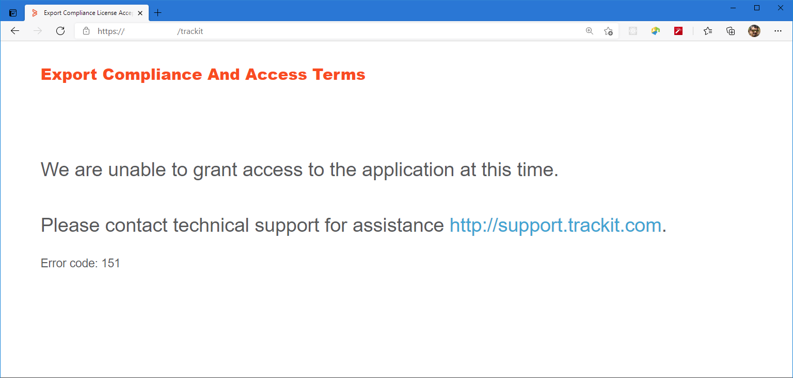
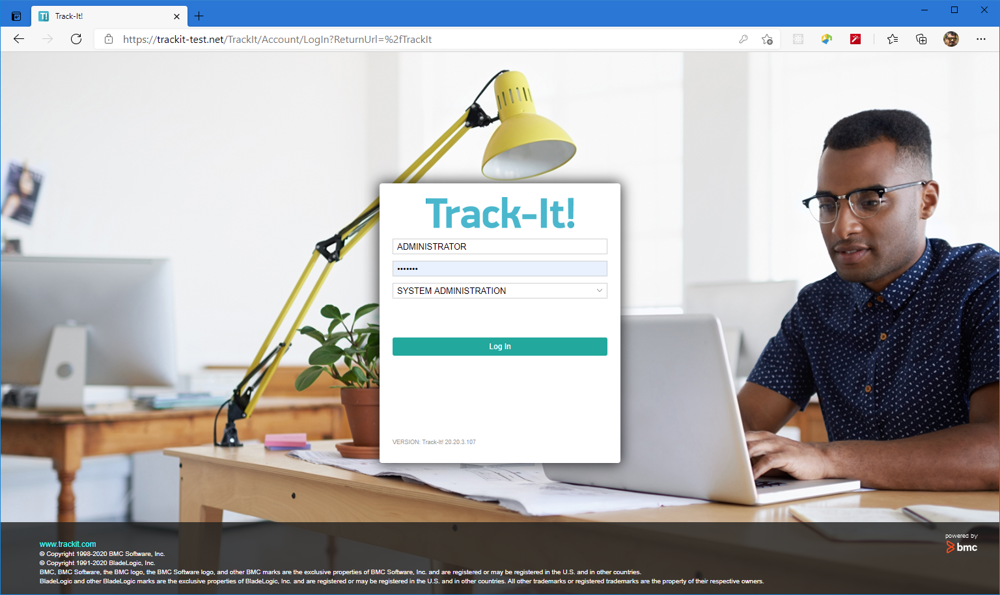
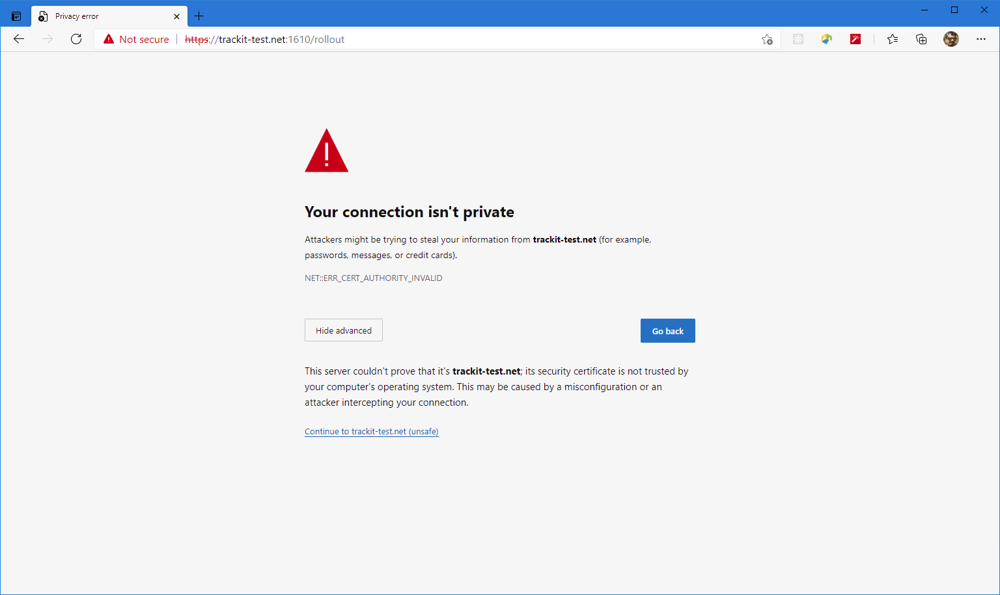
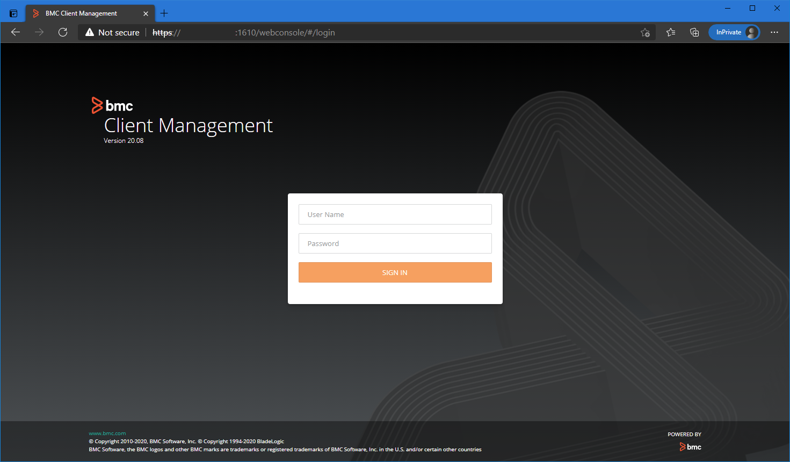
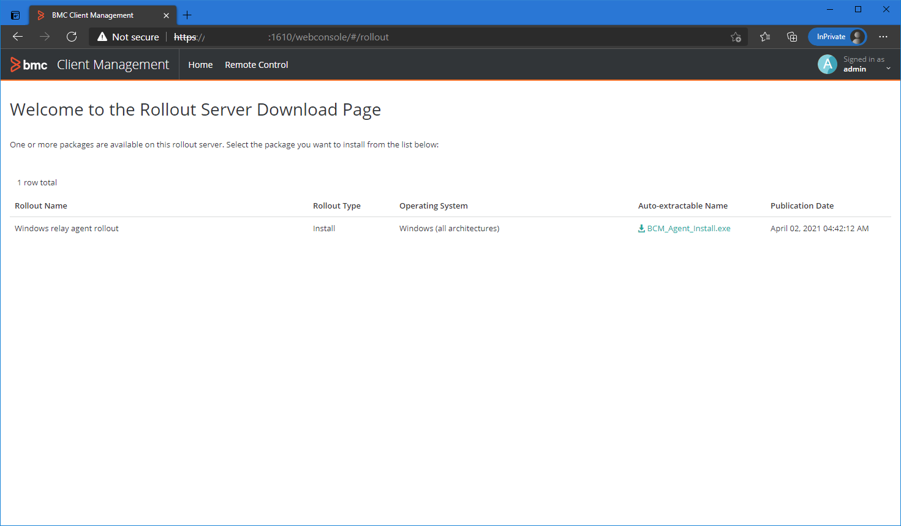

// Add steps as necessary for accessing the software, post-configuration, and testing. Don’t include full usage instructions for your software, but add links to your product documentation for that information.
//Should any sections not be applicable, remove them

== Test the deployment
// If steps are required to test the deployment, add them here. If not, remove the heading

== Post deployment steps
After the deployment is successful, you can launch the Technician portal. The Technician portal is denoted by *TrackItTechnicianPortalPublicURL* and is available on the output pane of the *CloudFormation* stack. 

=== Export Compliance
When you launch the application URL for the first time, the *Export Compliance And Access Terms* is displayed. You must accept the terms to access {partner-product-short-name}.

[#export1]
.Export Compliance and Access Terms
[link=images/export_compliance.png]
image::../images/export_compliance.png[export,width=648,height=439]

After you click *Continue* on the *Export Compliance And Access Terms* screen, the information is processed by a BMC system for auditing purposes. If we determine that you cannot be provided access, then a message similar to the following message is displayed:

[#export2]
.Export Compliance error
[link=images/export_compliance_error.png]

You must contact BMC Support with the information that is displayed in Figure 4 for assistance.

If there is no error, the {partner-product-short-name} Technician portal login screen is displayed as shown in the following figure:

[#trackit1]
.{partner-product-short-name} Technician portal login screen
[link=images/trackit1.png]

=== BMC Client Management Relay server
To fully leverage the BMC Client Management functionality, you must install the BMC Client Management relay software on one of your on-premises servers. This relay collects information of your on-premises network infrastructure and transmits it to the master server located on the AWS Cloud.

The relay installation can be accessed via the *BCMRolloutPublicURL* available on the CloudFormation *output* tab. 

Upon launching the *BCMRolloutPublicURL* in a browser, a warning as shown in the following figure is displayed. This happens because BMC Client Management issues its own certificates. It is safe to continue.

[#rollout1]
.BMC Client Management rollout login warning
[link=images/rollout1.png]

Upon continuing the following login screen is displayed:

[#rollout2]
.BMC Client Management rollout login page
[link=images/rollout2.png]

You can login with the default credentials to access the rollout download page. 

Click the _BCM_Agent_Install.exe_ link to download the rollout installation. Then, run the program to complete the installation.

[#rollout3]
.BMC Client Management rollout download page
[link=images/rollout3.png]

==== Default credentials

|===
|System|User name |Password

// Space needed to maintain table headers
|Track-It! Technician portal|`+ADMINISTRATOR+` |`+welcome+`
|Track-It! Database user| `+_SMSYSADMIN_+` |`+bmcAdm1n!+`
|BMC Client Management|`+admin+` |`+Trackituser@06+`

|===

== Best practices for using {partner-product-short-name} on AWS
// Provide post-deployment best practices for using the technology on AWS, including considerations such as migrating data, backups, ensuring high performance, high availability, etc. Link to software documentation for detailed information.

_Add any best practices for using the software._

== Training Videos

For information about how to use and configure {partner-product-short-name}, see https://docs.bmc.com/docs/trackit2020/en/training-videos-912125636.html[Training videos^].

== Security
// Provide post-deployment best practices for using the technology on AWS, including considerations such as migrating data, backups, ensuring high performance, high availability, etc. Link to software documentation for detailed information.

_Add any security-related information._

== Other useful information
//Provide any other information of interest to users, especially focusing on areas where AWS or cloud usage differs from on-premises usage.

_Add any other details that will help the customer use the software on AWS._