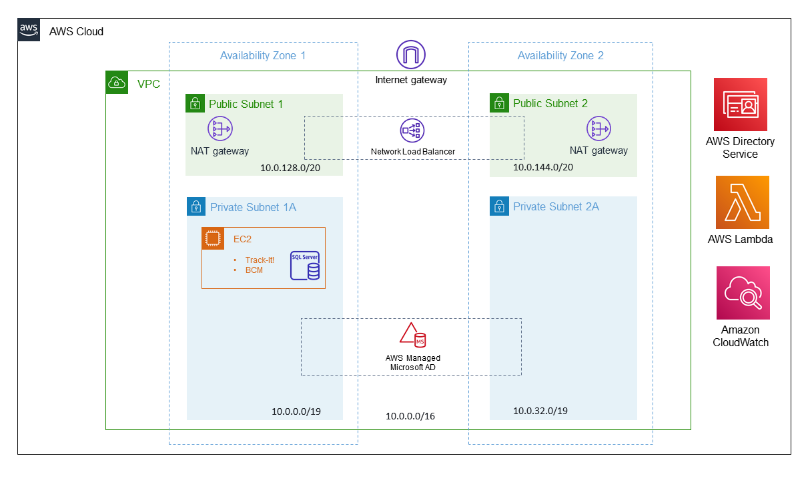

Deploying this Quick Start in a new Virtual Private Cloud (VPC) with
default parameters builds the following {partner-product-short-name} environment in the AWS Cloud:

// Replace this example diagram with your own. Send us your source PowerPoint file. Be sure to follow our guidelines here : http://(we should include these points on our contributors giude)
[#architecture1]
.Quick Start architecture for _{partner-product-short-name}_ on AWS
[link=images/aws_architecture_diagram.png]

//[TODO: Shardul] 
As seen in Figure 1, the Quick Start sets up the following:

* A highly available architecture that spans two Availability Zones.*
* A virtual private cloud (VPC) configured with public and private subnets, according to AWS best practices, to provide you with your own virtual network on AWS.*
* In the public subnets:
** Managed network address translation (NAT) gateways to allow outbound internet access for resources in the private subnets.*
** Network Load Balancer to ... .*
* In the private subnets:
** An Amazon EC2 instance running SQL Server with Track-It! help desk software and BMC Client Management server.
** AWS Managed Microsoft Active Directory (AD) to provide a fully managed Active Directory domain to which the Track-It EC2 instance is joined.
* AWS Directory Service to provision and manage AWS Managed Microsoft AD in the private subnets.
* AWS Lambda to ... .
* Amazon CloudWatch to monitor, store, and access log files from EC2 instances.

[.small]#* The template that deploys the Quick Start into an existing VPC skips the components marked by asterisks and prompts you for your existing VPC configuration.#

