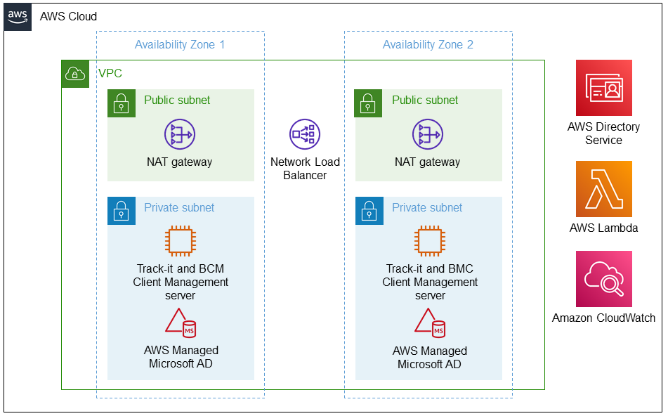

Deploying this Quick Start in a new Virtual Private Cloud (VPC) with
default parameters builds the following {partner-product-short-name} environment in the AWS Cloud:

// Replace this example diagram with your own. Send us your source PowerPoint file. Be sure to follow our guidelines here : http://(we should include these points on our contributors giude)
[#architecture1]
.Quick Start architecture for _{partner-product-short-name}_ on AWS
[link=images/architecture-diagram-bmc-track-it.png]

//[TODO: Shardul] 
As seen in Figure 1, the Quick Start sets up the following:

* A highly available architecture that spans two Availability Zones.*
* A virtual private cloud (VPC) configured with public and private subnets, according to AWS best practices, to provide you with your own virtual network on AWS.*
* A managed internet gateway to direct inbound traffic to a Network Load Balancer.
* In the public subnets, managed network address translation (NAT) gateways to allow outbound internet access for resources in the private subnets.*
* In the private subnet of Availability Zone 1, an Amazon EC2 instance with Microsoft SQL Server, Track-It!, and BMC Client Management software.
* AWS Directory Service for Microsoft Active Directory to provide a fully managed Active Directory domain to which the Track-It! EC2 instance is joined.
* Amazon CloudWatch to monitor, store, and access log files from EC2 instances.

[.small]#* The template that deploys the Quick Start into an existing VPC skips the components marked by asterisks and prompts you for your existing VPC configuration.#

